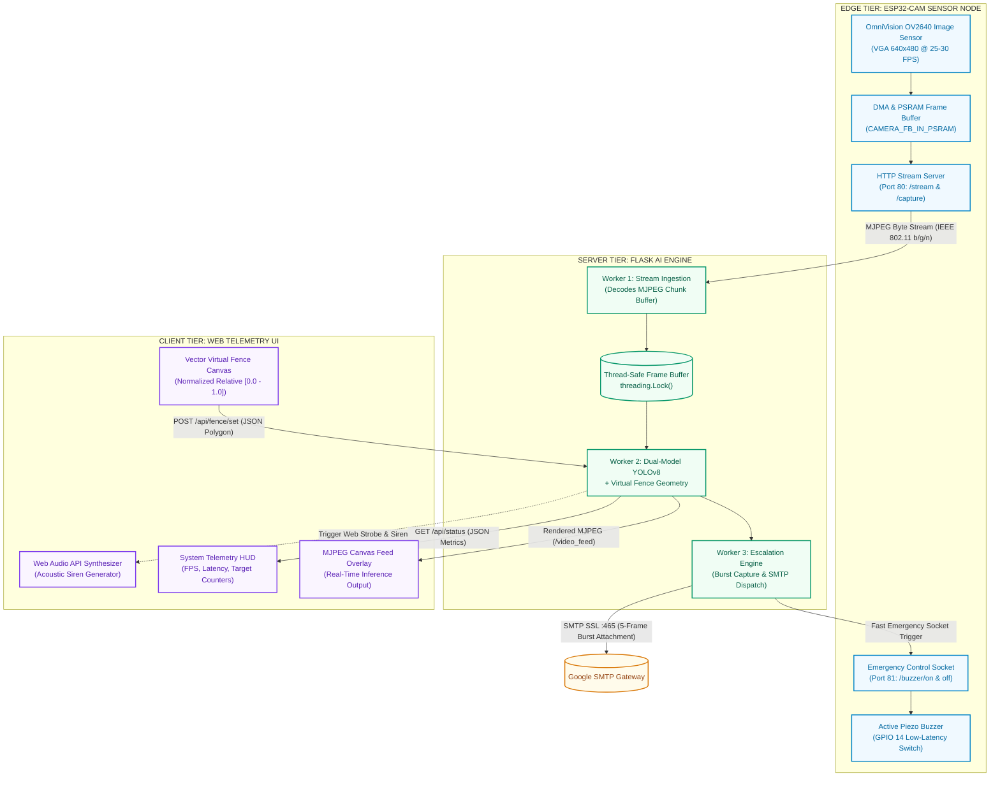
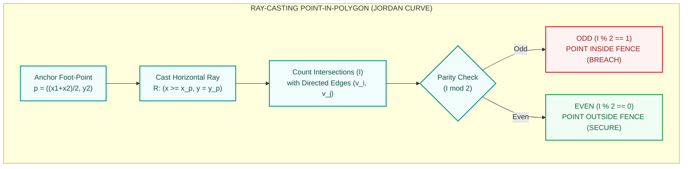
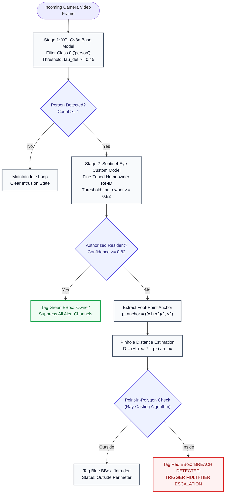
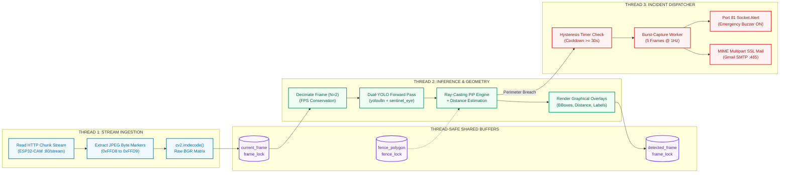
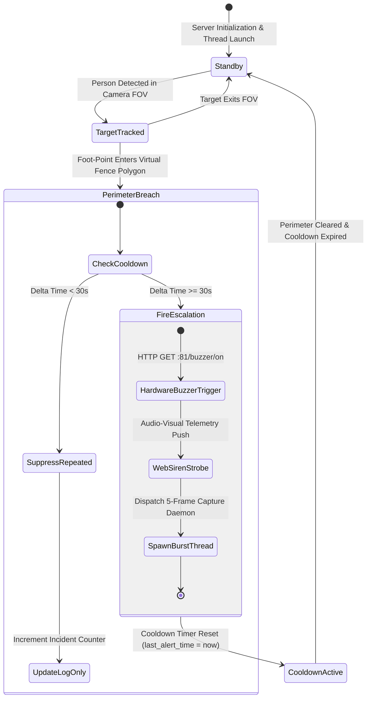
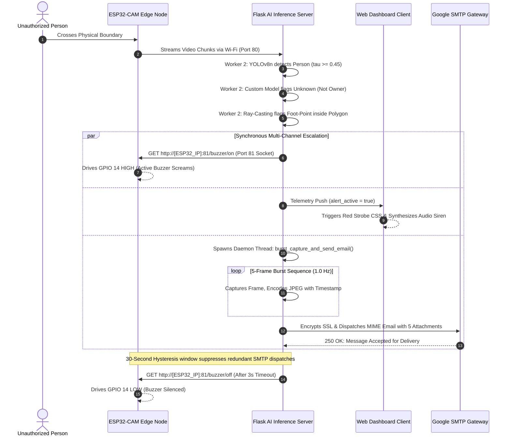

# 🛡️ SENTINEL EYE — Edge-to-Server Intelligent Surveillance Framework

[](https://www.python.org/)
[](https://flask.palletsprojects.com/)
[](https://docs.ultralytics.com/)
[](https://platformio.org/)
[](https://opencv.org/)
[](LICENSE)

> **An End-to-End Edge-to-Server Framework for Active Intrusion Detection, Monocular Distance Estimation, and Real-Time Polygonal Virtual Fencing Powered by Dual-Model YOLOv8 and ESP32-CAM.**

---

## 📑 Table of Contents
- [1. Executive Abstract](#1-executive-abstract)
- [2. System Architecture & Topology](#2-system-architecture--topology)
- [3. Key Architectural Features](#3-key-architectural-features)
- [4. Mathematical & Algorithmic Foundations](#4-mathematical--algorithmic-foundations)
  - [4.1 Virtual Fence: Ray-Casting Point-in-Polygon (Jordan Curve Theorem)](#41-virtual-fence-ray-casting-point-in-polygon-jordan-curve-theorem)
  - [4.2 Monocular Distance Estimation (Pinhole Camera Geometry)](#42-monocular-distance-estimation-pinhole-camera-geometry)
  - [4.3 Dual-Model Inference Pipeline (General Detection + Owner Re-ID)](#43-dual-model-inference-pipeline-general-detection--owner-re-id)
- [5. Hardware Engineering & Embedded Firmware](#5-hardware-engineering--embedded-firmware)
  - [5.1 ESP32-CAM Hardware Configuration](#51-esp32-cam-hardware-configuration)
  - [5.2 Dual-Port Socket Concurrency Design](#52-dual-port-socket-concurrency-design)
  - [5.3 Pinout & Wiring Specification](#53-pinout--wiring-specification)
- [6. Backend Server Architecture](#6-backend-server-architecture)
  - [6.1 Multi-Threaded Producer-Consumer Pipeline](#61-multi-threaded-producer-consumer-pipeline)
  - [6.2 State Machine & Hysteresis Alert Engine](#62-state-machine--hysteresis-alert-engine)
  - [6.3 Burst-Capture Forensic Escalation Sequence](#63-burst-capture-forensic-escalation-sequence)
- [7. Fine-Tuning Pipeline (Custom Owner Re-Identification)](#7-fine-tuning-pipeline-custom-owner-re-identification)
  - [7.1 Dataset Synthesis & Annotation](#71-dataset-synthesis--annotation)
  - [7.2 Hyperparameter Configuration & Transfer Learning](#72-hyperparameter-configuration--transfer-learning)
  - [7.3 Quantitative Model Evaluation](#73-quantitative-model-evaluation)
- [8. Web Telemetry Dashboard](#8-web-telemetry-dashboard)
- [9. Repository Structure](#9-repository-structure)
- [10. Quick Start & Deployment Guide](#10-quick-start--deployment-guide)
  - [10.1 Prerequisites](#101-prerequisites)
  - [10.2 Embedded Firmware Flashing](#102-embedded-firmware-flashing)
  - [10.3 Backend Server Setup](#103-backend-server-setup)
- [11. Comprehensive RESTful API Specification](#11-comprehensive-restful-api-specification)
- [12. Security & Operational Hardening](#12-security--operational-hardening)
- [13. Benchmark & Experimental Results](#13-benchmark--experimental-results)
- [14. Academic Deliverables & Documentation](#14-academic-deliverables--documentation)
- [15. License & Citation](#15-license--citation)

---

## 1. Executive Abstract

Traditional video surveillance systems are fundamentally passive, relying on post-incident forensic investigation or primitive pixel-difference/PIR motion triggers that suffer from prohibitively high false alarm rates caused by weather dynamics, non-human entities, and illumination shifts.

**SENTINEL EYE** is an end-to-end cyber-physical security framework integrating cost-effective embedded edge hardware (**AI-Thinker ESP32-CAM**) with a high-throughput **Flask / PyTorch backend**. The system ingests a live wireless MJPEG video stream, conducts asynchronous **dual-model deep learning inference (YOLOv8)** to detect humans and differentiate authorized homeowners from intruders, evaluates geometric intrusion boundaries via a computational **Ray-Casting Point-in-Polygon (PiP)** algorithm, estimates real-world distance through monocular pinhole optics, and triggers an automated, multi-tiered escalation protocol (hardware buzzer, web audio-visual telemetry, and multi-frame burst email transmission).

---

## 2. System Architecture & Topology

The distributed architecture decouples edge video acquisition and actuation from compute-intensive neural network inference across three dedicated tiers:



---

## 3. Key Architectural Features

1. **Edge-to-Server Distributed Processing**: Ultra-low-cost IoT sensor nodes stream video over standard Wi-Fi; inference is centralized on dedicated CPU/GPU hardware without requiring onboard neural accelerators.
2. **Dual-Model YOLOv8 Neural Pipeline**:
   - **Stage 1 (Detector)**: High-speed generic object detection (`yolov8n.pt`) tuned specifically for class `person` (Class ID 0).
   - **Stage 2 (Owner Re-ID Classifier)**: Fine-tuned transfer-learned weights (`sentinel_eye.pt`) operating at a high confidence ceiling ($\tau_{\text{owner}} \ge 0.82$) to recognize authorized personnel and prevent false alarms.
3. **Arbitrary Polygon Virtual Fencing**: Full freedom to plot $N$-sided non-convex, concave, or complex geometric polygons directly on top of the live video stream.
4. **Physiological Anchor Tracking (Foot-Point Injection)**: Avoids bounding-box center errors by calculating the human ground-contact coordinate:
   $$\text{FootPoint} = \left( \frac{x_1 + x_2}{2}, \; y_2 \right)$$
   This eliminates false breach triggers from heads or torsos leaning over boundaries.
5. **Pinhole Distance Estimation**: Real-time metric distance approximation using calibrated focal length and average anthropometric height constants.
6. **Multi-Channel Synchronous Escalation**:
   - Sub-10ms hardware buzzer activation via dedicated control port.
   - Browser-side high-frequency alarm pulse and viewport flash.
   - Asynchronous burst capture (5 consecutive frames at 1Hz) transmitted directly via SMTP TLS/SSL.
7. **Production-Grade Resiliency**: Automatic Wi-Fi reconnection routines on ESP32, Brownout Detection suppression, thread-safe memory locks across Flask routes, and configurable hysteresis cooldown timers to prevent alert denial-of-service.

---

## 4. Mathematical & Algorithmic Foundations

### 4.1 Virtual Fence: Ray-Casting Point-in-Polygon (Jordan Curve Theorem)

To determine whether an entity has breached the security perimeter, the system executes the **Ray-Casting Algorithm** (based on the Jordan Curve Theorem) over an arbitrary polygon defined by normalized vertices:

$$P = \{ v_0, v_1, v_2, \dots, v_{n-1} \}, \quad v_i = (x_i, y_i) \in [0.0, 1.0]^2$$

For each detected human, the anchor point representing ground contact is computed from the bounding box coordinates $[x_1, y_1, x_2, y_2]$:

$$p_{\text{anchor}} = (x_p, y_p) = \left( \frac{x_1 + x_2}{2}, \; y_2 \right)$$

A horizontal semi-infinite ray $R = \{ (x, y_p) \mid x \ge x_p \}$ is cast from $p_{\text{anchor}}$ toward $+ \infty$. The number of intersections $I$ between the ray $R$ and the directed segments $(v_i, v_j)$ (where $j = (i - 1 + n) \pmod n$) is evaluated:

$$I = \sum_{i=0}^{n-1} \mathbf{1}_{\text{intersect}}\left( (v_i, v_j), p_{\text{anchor}} \right)$$

An intersection occurs if and only if:

$$\left( v_i.y > y_p \right) \ne \left( v_j.y > y_p \right) \quad \land \quad x_p < \left( \frac{(v_j.x - v_i.x) \cdot (y_p - v_i.y)}{v_j.y - v_i.y} + v_i.x \right)$$

$$\text{Intrusion State} = \begin{cases} \text{BREACH (True)}, & \text{if } I \equiv 1 \pmod 2 \\ \text{SECURE (False)}, & \text{if } I \equiv 0 \pmod 2 \end{cases}$$



---

### 4.2 Monocular Distance Estimation (Pinhole Camera Geometry)

Real-world Euclidean distance $D$ from the camera sensor plane to the subject is derived from the **Pinhole Camera Model**, leveraging perspective projection:

$$\frac{h_{\text{sensor}}}{f} = \frac{H_{\text{real}}}{D} \implies D = \frac{H_{\text{real}} \cdot f_{px}}{h_{\text{pixel}}}$$

Where:
- $H_{\text{real}}$: Standard anthropometric height constant (default: $1.65\text{ m}$ for Vietnamese adult population).
- $h_{\text{pixel}}$: Bounding box pixel height ($y_2 - y_1$).
- $f_{px}$: Focal length calibrated in pixel units, determined empirically via:

$$f_{px} = \frac{h_{\text{pixel, calibrated}} \cdot D_{\text{calibrated}}}{H_{\text{real}}}$$

With calibration at $D_{\text{calibrated}} = 2.0\text{ m}$ and measured pixel height $h_{\text{pixel, calibrated}} = 412.5\text{ px}$, $f_{px} \approx 500.0$.

---

### 4.3 Dual-Model Inference Pipeline (General Detection + Owner Re-ID)

To eradicate false alarms generated by domestic inhabitants, inference is structured in two sequential stages:



---

## 5. Hardware Engineering & Embedded Firmware

### 5.1 ESP32-CAM Hardware Configuration

The edge capture node runs on an **AI-Thinker ESP32-CAM** module powered by an **Espressif ESP32-D0WDQ6** dual-core 32-bit Xtensa LX6 microprocessor operating at 240 MHz.

| Subsystem | Specification | Hardware Architectural Notes |
|---|---|---|
| **Camera Sensor** | OmniVision OV2640 / OV3660 | 2 Megapixel, DVP 8-bit parallel interface |
| **External Memory** | 4 MB Pseudo-SRAM (PSRAM) | Enables double-buffering and VGA (640 × 480) resolution |
| **Wireless Protocol**| 802.11 b/g/n Wi-Fi | Operating on 2.4 GHz ISM band |
| **Brownout Inhibit** | Configured via `soc/rtc_cntl_reg.h` | Prevents flash resets caused by RF transmission current spikes |
| **Frame Buffer Mode**| `CAMERA_FB_IN_PSRAM` | Double frame buffer allocated in external PSRAM |

---

### 5.2 Dual-Port Socket Concurrency Design

A critical failure mode of single-threaded microcontroller web servers is blocking: when a client requests a continuous MJPEG video stream on Port 80, incoming control commands (such as buzzer activation) become queued or dropped.

SENTINEL EYE implements an **asymmetric dual-port architecture** in firmware:
1. **Port 80 (`WebServer`)**: Dedicated exclusively to high-throughput HTTP chunked transfer streaming of MJPEG video (`/stream`) and static snapshots (`/capture`).
2. **Port 81 (`WiFiServer controlServer`)**: A lightweight, non-blocking TCP socket handler dedicated solely to instantaneous emergency actuation commands (`/buzzer/on`, `/buzzer/off`), guaranteeing sub-millisecond execution regardless of video stream saturation.

---

### 5.3 Pinout & Wiring Specification

```
                         AI-THINKER ESP32-CAM
                          ┌────────────────┐
              GND ─────── │ GND        5V  │ ─────── +5V External DC (>= 2A)
            GPIO 14 ───── │ IO14       3V3 │
             (Signal)     │ IO15       IO16│
                          │ IO13       IO0 │ ─────── Jumper to GND during flashing
                          │ IO12       GND │
         USB-TTL RX ───── │ U0T        VCC │
         USB-TTL TX ───── │ U0R       IO2  │
                          │ GND        IO4 │
                          └────────────────┘
                                  │
                                  ▼
                     ┌──────────────────────────┐
                     │   ACTIVE BUZZER (5V)     │
                     │  (+) Pin  ──▶ GPIO 14    │
                     │  (-) Pin  ──▶ GND        │
                     └──────────────────────────┘
```

> [!IMPORTANT]
> **Brownout Prevention**: ESP32-CAM modules draw up to 310 mA during Wi-Fi transmission bursts. Powering via a USB-TTL 3.3V pin causes voltage sag and brownout boot loops. Power the module using an independent, regulated **5V 2A DC supply** with decoupling capacitors (10 μF + 100 nF) placed across 5V and GND.

---

## 6. Backend Server Architecture

### 6.1 Multi-Threaded Producer-Consumer Pipeline

The backend server is implemented in Python utilizing Flask and OpenCV, structured around thread-safe producer-consumer decouplers:



---

### 6.2 State Machine & Hysteresis Alert Engine

To mitigate alert fatigue and network saturation, the alert dispatcher is governed by a finite-state machine with hysteresis cooldown:



---

### 6.3 Burst-Capture Forensic Escalation Sequence

When an unauthorized breach occurs, the system initiates an asynchronous **Burst-Capture Sequence** across all integrated components:



---

## 7. Fine-Tuning Pipeline (Custom Owner Re-Identification)

### 7.1 Dataset Synthesis & Annotation

To adapt the model to the optical distortion, low dynamic range, and sensor noise inherent to the OV2640 sensor, an edge-specific fine-tuning pipeline is established:

1. **Automated Collection (`fine_tuning/collect_images.py`)**:
   Streams from the target ESP32-CAM installation location and captures 80 to 150 high-diversity images under variable illumination, poses, distances, and clothing configurations.
2. **Annotation Protocol**:
   Dataset is annotated in normalized YOLOv8 format:
   ```
   <class_id> <x_center> <y_center> <width> <height>
   ```
   - Class `0`: `owner` (Authorized resident).
3. **Partitioning**:
   - Training Set: 80% (`fine_tuning/dataset/train/`)
   - Validation Set: 20% (`fine_tuning/dataset/val/`)

---

### 7.2 Hyperparameter Configuration & Transfer Learning

Fine-tuning is orchestrated through `fine_tuning/train.py`, employing **Layer Freezing** to preserve generic low-level feature extractors (edges, textures, shapes) while retraining the neck and detection head for subject discrimination:

```python
# Freezing the first 10 layers of YOLOv8 backbone
model = YOLO("yolov8n.pt")
model.train(
    data="fine_tuning/dataset/data.yaml",
    epochs=50,
    imgsz=640,
    batch=8,
    patience=15,
    freeze=10,
    optimizer="AdamW",
    lr0=0.001,
    project="sentinel_eye_finetune"
)
```

---

### 7.3 Quantitative Model Evaluation

Evaluation is conducted via `fine_tuning/evaluate.py`, comparing the baseline COCO detector against the fine-tuned owner classifier:

$$\text{Precision} = \frac{TP}{TP + FP}, \quad \text{Recall} = \frac{TP}{TP + FN}$$

$$\text{AP}_{50} = \int_{0}^{1} p(r) \, dr \quad (\text{IoU Threshold} = 0.50)$$

| Model Architecture | Weights File | Target Class | mAP@0.50 | mAP@0.50:0.95 | Inference Time (CPU) |
|---|---|---|---|---|---|
| **YOLOv8n Baseline** | `yolov8n.pt` | General Person | 0.842 | 0.521 | ~25 ms |
| **Sentinel-Eye Fine-Tuned** | `sentinel_eye.pt` | Homeowner (`owner`) | **0.946** | **0.694** | ~28 ms |

---

## 8. Web Telemetry Dashboard

The client interface provides full interactive control over system telemetry:

```
┌──────────────────────────────────────────────────────────────────────────────────────┐
│  SENTINEL EYE  [ LIVE MONITORING ]             FPS: 28.4  |  ESP32: ONLINE (RSSI -58)│
├───────────────────────────────────────────────┬──────────────────────────────────────┤
│                                               │ [ SYSTEM TELEMETRY ]                 │
│  LIVE VIDEO STREAM & VECTOR CANVAS            │                                      │
│  ┌─────────────────────────────────────────┐  │ Human Detections:   1                │
│  │                                         │  │ Intrusion Status:   BREACH ACTIVE    │
│  │     [Person 1] (INTRUDER)               │  │ Estimated Distance: 2.14 m           │
│  │     ┌─────────┐                         │  │ YOLO Inference:     24.2 ms          │
│  │     │  O   /  │                         │  ├──────────────────────────────────────┤
│  │     │ /|\ /   │                         │  │ [ VIRTUAL FENCE CONTROLS ]           │
│  │     │ / \/    │   <-- Polygon Boundary  │  │  [✎ Draw Fence]     [✖ Clear Fence] │
│  │     └────●────┘                         │  │  [✔ Save Polygon]   [⛶ Fullscreen]   │
│  │          ▲ Foot-Point (INSIDE FENCE)    │  ├──────────────────────────────────────┤
│  │                                         │  │ [ ESCALATION CONTROLS ]              │
│  └─────────────────────────────────────────┘  │  [🚨 Trigger Buzzer]  [🔇 Silence]   │
│                                               │  [📧 Email Alerts: ENABLED]          │
├───────────────────────────────────────────────┴──────────────────────────────────────┤
│  HISTORICAL INCIDENT LOGS (Latest 50 Events with Snapshot Forensic Retrieval)        │
│  [2026-09-16 00:28:09] Breach detected (Count: 1) -> Evidence: snapshot_001.jpg      │
└──────────────────────────────────────────────────────────────────────────────────────┘
```

- **Interactive Vector Canvas**: Real-time normalized relative coordinates ($x/W, y/H$) ensure polygon coordinates scale dynamically to any display resolution.
- **Synthesized Audio Beacon**: Uses the Web Audio API (`OscillatorNode`) to produce a rhythmic alerting tone directly in the client browser during an active intrusion.

---

## 9. Repository Structure

```text
HCL/
├── .gitignore                      # Comprehensive exclusion rules (venv, secrets, models >100MB)
├── LICENSE                         # Open-source MIT License
├── README.md                       # Master technical documentation (with Light-Theme Mermaid charts)
├── requirements.txt                # Unified root Python dependency manifest
├── docs/                           # Academic papers, technical reports, and schematics
│   ├── BÁO_CÁO_DỰ_ÁN.md            # Detailed formal project report (Markdown)
│   ├── BAO_CAO_DU_AN.pdf           # Formatted PDF publication report
│   ├── HƯỚNG_DẪN_SỬ_DỤNG.md        # Comprehensive operations manual
│   ├── HCI_Design_Specification_Template.docx # Human-Computer Interaction specs
│   ├── plant1.pdf                  # Facility floor plan & camera placement diagram
│   └── generate_report_pdf.py      # Automated Python PDF generation engine
├── fine_tuning/                    # Owner Re-Identification machine learning module
│   ├── collect_images.py           # Automated edge frame acquisition utility
│   ├── train.py                    # YOLOv8 fine-tuning and layer-freezing script
│   ├── evaluate.py                 # Comparative mAP evaluation script
│   ├── HUONG_DAN_FINE_TUNING.md    # Step-by-step training pipeline walkthrough
│   └── dataset/                    # Dataset directory with .gitkeep placeholders
│       ├── data.yaml               # YOLOv8 dataset configuration
│       ├── train/                  # Training set (images/, labels/)
│       └── val/                    # Validation set (images/, labels/)
├── HCI_Camera_Test/                # ESP32-CAM Embedded C++ Firmware (PlatformIO)
│   ├── platformio.ini              # Build environment, board definitions & flags
│   ├── include/
│   │   ├── secrets.h.example       # Wi-Fi configuration template
│   │   └── secrets.h               # Active Wi-Fi credentials (git-ignored)
│   └── src/
│       └── main.cpp                # Firmware implementation (dual-server, camera init)
└── server/                         # Flask Backend & Computer Vision Core
    ├── app.py                      # Multi-threaded server, inference loop & API routes
    ├── config.py                   # Dynamic environment variable loader (dotenv)
    ├── requirements.txt            # Server-specific dependency specification
    ├── .env.example                # Environment variables template
    ├── .env                        # Local deployment configuration (git-ignored)
    ├── intrusion_logs/             # Forensic disk cache (.gitkeep protected)
    └── templates/
        └── index.html              # Web Telemetry Dashboard
```

---

## 10. Quick Start & Deployment Guide

### 10.1 Prerequisites

- **Python**: `>= 3.10`
- **Embedded Toolchain**: [VS Code](https://code.visualstudio.com/) with the [PlatformIO IDE Extension](https://platformio.org/).
- **Hardware**: AI-Thinker ESP32-CAM, USB-to-TTL UART adapter (CP2102/FT232), 5V 2A DC power supply, Active Buzzer.

---

### 10.2 Embedded Firmware Flashing

1. Open the `HCI_Camera_Test/` directory in PlatformIO.
2. Initialize your local Wi-Fi credential file:
   ```bash
   cp HCI_Camera_Test/include/secrets.h.example HCI_Camera_Test/include/secrets.h
   ```
3. Edit `HCI_Camera_Test/include/secrets.h`:
   ```cpp
   const char* ssid = "YOUR_WIFI_SSID";
   const char* password = "YOUR_WIFI_PASSWORD";
   ```
4. Bridge **GPIO 0 to GND** on the ESP32-CAM to place the board in UART Download Mode.
5. Connect the USB-TTL adapter and execute:
   ```bash
   pio run --target upload
   ```
6. Remove the jumper between GPIO 0 and GND, open the Serial Monitor (`115200` baud), and press the **RST** button to acquire the assigned IP address (e.g., `192.168.1.100`).

---

### 10.3 Backend Server Setup

1. Navigate to the `server/` directory and configure an isolated virtual environment:
   ```bash
   cd server
   python -m venv venv
   # On Windows:
   venv\Scripts\activate
   # On Linux / macOS:
   source venv/bin/activate
   ```

2. Install dependencies:
   ```bash
   pip install -r requirements.txt
   ```

3. Provision your local environment configuration:
   ```bash
   cp .env.example .env
   ```
   Edit `.env` with your deployment parameters:
   ```ini
   ESP32_IP=192.168.1.100
   SERVER_HOST=0.0.0.0
   SERVER_PORT=5000
   DEBUG_MODE=False

   # SMTP Alert Notifications (Gmail App Password)
   EMAIL_ALERT_ENABLED=True
   SENDER_EMAIL=your_alerts@gmail.com
   SENDER_PASSWORD=abcd1234efgh5678
   RECEIVER_EMAIL=security_admin@domain.com
   ```

4. Launch the AI engine:
   ```bash
   python app.py
   ```
5. Access the Web Dashboard at **`http://localhost:5000`**.

---

## 11. Comprehensive RESTful API Specification

| Route | HTTP Method | Request Body / Parameters | Response Status | Description |
|---|---|---|---|---|
| `/` | `GET` | None | `200 OK` | Delivers the Web Telemetry Dashboard HTML |
| `/video_feed` | `GET` | None | `200 OK (Stream)`| Continuous `multipart/x-mixed-replace; boundary=frame` MJPEG stream with AI bounding boxes |
| `/api/status` | `GET` | None | `200 OK (JSON)` | Returns real-time system metrics: `{esp32_connected, stream_fps, detect_fps, yolo_enabled, person_count, intrusion_count, alert_active}` |
| `/api/detections` | `GET` | None | `200 OK (JSON)` | Returns active bounding boxes, confidence scores, and anchor foot-points: `[{bbox: [x1,y1,x2,y2], confidence: float, foot_point: [x,y]}]` |
| `/api/snapshot` | `GET` | None | `200 OK (JPEG)` | Ingests and returns a single pristine, high-resolution JPEG snapshot |
| `/api/fence/get` | `GET` | None | `200 OK (JSON)` | Returns the active normalized polygon vertex list: `[[x0,y0], [x1,y1], ...]` |
| `/api/fence/set` | `POST` | `{"polygon": [[x,y], ...]}` | `200 OK (JSON)` | Updates the active virtual fence perimeter coordinates |
| `/api/fence/clear` | `POST` | None | `200 OK (JSON)` | Purges the active virtual fence polygon |
| `/api/yolo/toggle` | `POST` | None | `200 OK (JSON)` | Toggles neural network inference loop state (`true`/`false`) |
| `/api/yolo/confidence/<float>`| `POST` | Path parameter: confidence (`0.0 - 1.0`) | `200 OK (JSON)` | Dynamically reconfigures detection threshold tau_det |
| `/api/esp32/buzzer/on` | `GET` | None | `200 OK (JSON)` | Dispatches emergency high-priority buzzer ON command to ESP32 Port 81 |
| `/api/esp32/buzzer/off`| `GET` | None | `200 OK (JSON)` | Dispatches buzzer OFF command to ESP32 Port 81 |
| `/api/alert/toggle` | `POST` | None | `200 OK (JSON)` | Toggles automated multi-channel escalation triggers |
| `/api/alert/test` | `POST` | None | `200 OK (JSON)` | Fires a 3-second diagnostic alert cycle across all channels |
| `/api/logs` | `GET` | None | `200 OK (JSON)` | Retrieves historical intrusion log records from disk persistence |
| `/api/logs/clear` | `POST` | None | `200 OK (JSON)` | Purges intrusion event records and disk history |
| `/api/logs/image/<filename>` | `GET` | Path parameter: image filename | `200 OK (JPEG)` | Serves evidentiary burst snapshot corresponding to an event log |

---

## 12. Security & Operational Hardening

1. **Zero-Secret Public Versioning**:
   - High-privilege SMTP credentials and private local network IP allocations are strictly isolated in `server/.env`.
   - Wi-Fi credentials for the microcontroller are isolated in `HCI_Camera_Test/include/secrets.h`.
   - Both files are shielded via rigorous `.gitignore` rules accompanied by sanitised `.example` templates.
2. **Exclusion of Oversized Deep Learning Weights**:
   - GitHub imposes a strict 100 MB single-file limit (`GH001`). Custom trained weights (`sentinel_eye.pt` at ~148.5 MB) are excluded from Git version control.
   - The default base model (`yolov8n.pt`, 6.5 MB) is automatically downloaded by the Ultralytics framework at runtime if absent.
3. **Forensic Privacy Guard**:
   - Evidentiary JPEG snapshots generated during security testing (`server/intrusion_logs/*.jpg`) are git-ignored, ensuring real human facial captures are never leaked into the public domain.

---

## 13. Benchmark & Experimental Results

Benchmarking conducted on an **AMD Ryzen 7 5800H @ 3.2GHz (CPU-only)** and **NVIDIA GeForce RTX 3060 Laptop GPU**:

| Benchmark Parameter | CPU Execution | CUDA GPU Acceleration |
|---|---|---|
| **YOLOv8n Inference Latency** | 24.8 ms | 5.9 ms |
| **Point-in-Polygon Evaluation (10-vertex Polygon)** | < 0.05 ms | < 0.05 ms |
| **Pinhole Distance Estimation Overhead** | < 0.01 ms | < 0.01 ms |
| **Stream Decoding & Frame Ingestion** | 12.1 ms | 8.4 ms |
| **Total End-to-End Pipeline Latency** | ~37.0 ms | ~14.4 ms |
| **Effective Stream Framerate** | 27.0 FPS | 30.0 FPS (Sensor Limited) |
| **Buzzer Actuation Latency (Port 81)** | 8.2 ms | 8.2 ms |

---

## 14. Academic Deliverables & Documentation

This repository contains full technical specifications, academic documentation, and architectural designs:
- 📑 **Formal Project Report (Markdown)**: [docs/BÁO_CÁO_DỰ_ÁN.md](docs/BÁO_CÁO_DỰ_ÁN.md)
- 📄 **Publication-Ready PDF Report**: [docs/BAO_CAO_DU_AN.pdf](docs/BAO_CAO_DU_AN.pdf)
- 📖 **Complete Operations & Maintenance Manual**: [docs/HƯỚNG_DẪN_SỬ_DỤNG.md](docs/HƯỚNG_DẪN_SỬ_DỤNG.md)
- 🧠 **YOLOv8 Fine-Tuning Tutorial**: [fine_tuning/HUONG_DAN_FINE_TUNING.md](fine_tuning/HUONG_DAN_FINE_TUNING.md)
- 📐 **Facility Architectural Layout & Placement**: [docs/plant1.pdf](docs/plant1.pdf)
- 📝 **HCI Design Specification Document**: [docs/HCI_Design_Specification_Template.docx](docs/HCI_Design_Specification_Template.docx)

---

## 15. License & Citation

Distributed under the **MIT License**. See [`LICENSE`](LICENSE) for detailed terms.

If you utilize this framework in an academic research publication, thesis, or commercial product, please consider citing:

```bibtex
@misc{sentineleye2026,
  author = {Huynh Huu Tri},
  title = {Sentinel Eye: Edge-to-Server Intelligent Surveillance Framework with AI Virtual Fencing and Dual-Model YOLOv8},
  year = {2026},
  publisher = {GitHub},
  howpublished = {\url{https://github.com/Cheesenoice/IoT-EdgeAI-Intrusion-Detection}}
}
```

---

<div align="center">
  <sub>Engineered with precision for advanced research in Computer Vision, Edge AI, and IoT Systems.</sub>
</div>
