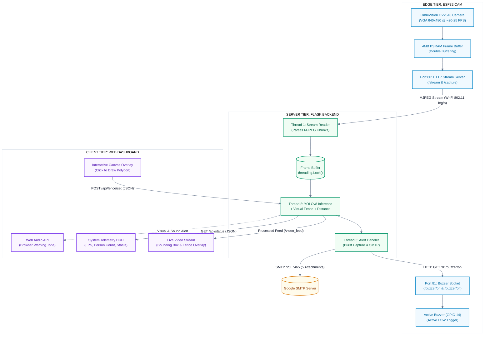
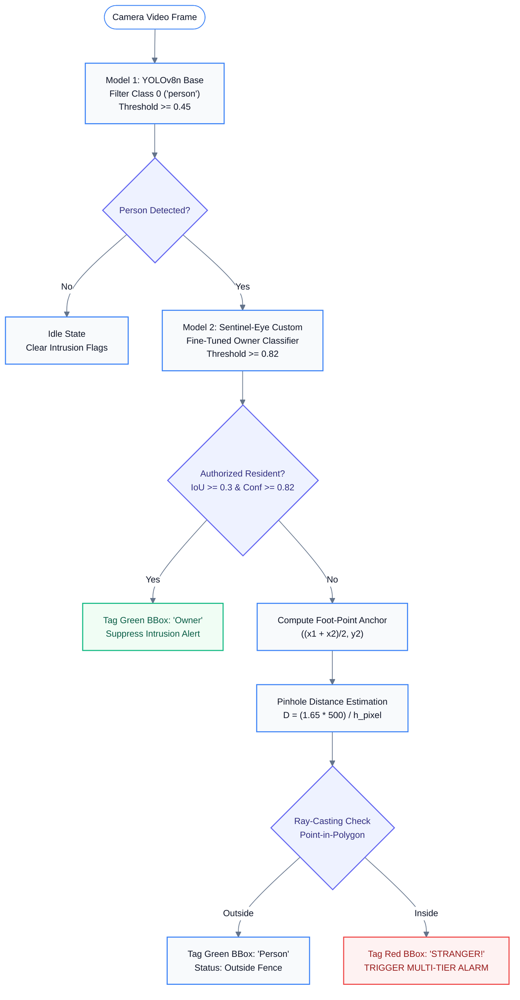

# 🛡️ SENTINEL EYE — Edge-to-Server Smart Surveillance System

[](https://www.python.org/)
[](https://flask.palletsprojects.com/)
[](https://docs.ultralytics.com/)
[](https://platformio.org/)
[](https://opencv.org/)
[](https://youtu.be/n2op9aZQfCc)
[](LICENSE)

> [!IMPORTANT]
> ### 📑 Official Academic Project Report & Video Demonstration
> **Posts and Telecommunications Institute of Technology (PTIT) — Faculty of Information Technology**  
> Course: **Human-Computer Interaction (HCI)** | Academic Year: **2026** | Author: **Huynh Huu Tri**  
> 
> 🎥 **[👉 Watch System Video Demonstration on YouTube (https://youtu.be/n2op9aZQfCc) 👈](https://youtu.be/n2op9aZQfCc)**  
> 📥 **[👉 View & Download Full PDF Report on Google Drive 👈](https://drive.google.com/file/d/1O0312Y3JlM2RKBX1bc4fR-lGt-6NuERv/view?usp=sharing)**  
> 📄 **Local Repository Files**: [`docs/PROJECT_REPORT.pdf`](docs/PROJECT_REPORT.pdf) (18-page publication PDF with Bookmarks) · [`docs/PROJECT_REPORT.md`](docs/PROJECT_REPORT.md)

---

## 📑 Table of Contents
- [1. Project Overview](#1-project-overview)
- [📸 Live Demonstration Highlights](#-live-demonstration-highlights)
- [2. System Architecture](#2-system-architecture)
- [3. Key System Capabilities](#3-key-system-capabilities)
- [4. Algorithms & Mathematical Formulations](#4-algorithms--mathematical-formulations)
  - [4.1 Virtual Fence: Ray-Casting Point-in-Polygon](#41-virtual-fence-ray-casting-point-in-polygon)
  - [4.2 Monocular Distance Approximation](#42-monocular-distance-approximation)
  - [4.3 Dual-Model Inference: Detection & Owner Re-ID](#43-dual-model-inference-detection--owner-re-id)
- [5. Hardware Engineering & Embedded Firmware](#5-hardware-engineering--embedded-firmware)
  - [5.1 ESP32-CAM Hardware Configuration](#51-esp32-cam-hardware-configuration)
  - [5.2 Dual-Port HTTP Server Design](#52-dual-port-http-server-design)
  - [5.3 Pinout & Wiring Specification](#53-pinout--wiring-specification)
- [6. Backend Server Architecture](#6-backend-server-architecture)
  - [6.1 Multi-Threaded Processing Pipeline](#61-multi-threaded-processing-pipeline)
  - [6.2 State Machine & 30s Cooldown Hysteresis](#62-state-machine--30s-cooldown-hysteresis)
  - [6.3 Burst Capture & Email Notification Sequence](#63-burst-capture--email-notification-sequence)
- [7. Owner Fine-Tuning Pipeline](#7-owner-fine-tuning-pipeline)
  - [7.1 Image Collection & Annotation](#71-image-collection--annotation)
  - [7.2 Transfer Learning with Layer Freezing](#72-transfer-learning-with-layer-freezing)
- [8. Web Telemetry Dashboard](#8-web-telemetry-dashboard)
- [9. Repository Structure](#9-repository-structure)
- [10. Quick Start & Deployment Guide](#10-quick-start--deployment-guide)
  - [10.1 Prerequisites](#101-prerequisites)
  - [10.2 Flashing ESP32-CAM Firmware](#102-flashing-esp32-cam-firmware)
  - [10.3 Setting Up Flask Backend](#103-setting-up-flask-backend)
- [11. RESTful API Specification](#11-restful-api-specification)
- [12. Configuration & Security Hardening](#12-configuration--security-hardening)
- [13. Measured System Performance](#13-measured-system-performance)
- [14. Academic Deliverables & Documentation](#14-academic-deliverables--documentation)
- [15. License & Citation](#15-license--citation)

---

## 1. Project Overview

**SENTINEL EYE** is an IoT and Computer Vision surveillance project developed for the **Human-Computer Interaction (HCI)** course at the **Posts and Telecommunications Institute of Technology (PTIT)**.

Traditional surveillance cameras typically rely on passive recording or simple pixel-difference motion sensors that trigger frequent false alarms from pets, windblown trees, or lighting changes. 

SENTINEL EYE addresses this problem through a practical edge-to-server architecture:
- An inexpensive **AI-Thinker ESP32-CAM** module captures and streams video over Wi-Fi.
- A **Python Flask server** ingests the video feed and runs **YOLOv8** to accurately detect humans.
- Operators can draw an **arbitrary polygonal virtual fence** directly onto the live web video feed.
- The system evaluates whether a person's **ground-contact foot point** has breached the fence using the **Ray-Casting Point-in-Polygon algorithm**.
- A custom fine-tuned YOLOv8 model distinguishes authorized **homeowners** from unknown visitors, suppressing domestic false alarms.
- When an unauthorized intrusion is confirmed, the system activates a **physical buzzer** on the ESP32, triggers a **web audio-visual warning**, and dispatches an **email with 5 burst-capture snapshots** to the administrator.

---

## 📸 Live Demonstration Highlights

### 🎥 End-to-End System Video Demonstration

<div align="center">
  <a href="https://youtu.be/n2op9aZQfCc" target="_blank">
    
  </a>
  <p>
    <strong><a href="https://youtu.be/n2op9aZQfCc" target="_blank">▶️ Click here to watch the full operational video demo on YouTube (https://youtu.be/n2op9aZQfCc)</a></strong><br>
    <em>Full end-to-end demonstration: ESP32-CAM video streaming, interactive polygon fencing, dual-model YOLOv8 human detection & homeowner re-identification, physical buzzer actuation, and automated forensic email alerts.</em>
  </p>
</div>

### 📷 Real-World System Captures & Evidence

Below are real-world photographic captures and telemetry screenshots recorded during operational testing of the **SENTINEL EYE** system:

| 🎥 Real-World Edge Deployment | 🚨 Real-Time Virtual Fence Breach Detection |
|:---:|:---:|
|  |  |
| *AI-Thinker ESP32-CAM sensor node positioned in domestic testing zone.* | *Real-time intrusion discrimination inside 6-vertex polygon (Red BBox: INTRUDER).* |

| 👤 Dual-Model Homeowner Re-Identification | 📧 Multi-Frame Forensic Email Alert |
|:---:|:---:|
|  |  |
| *Stage 2 fine-tuned model identifying authorized resident (Green BBox), suppressing false alarms.* | *Automated SSL SMTP email alert delivered with 5 burst-capture snapshot attachments.* |

---

## 2. System Architecture

The system decouples low-cost edge video capture from compute-intensive neural network inference across three tiers:



---

## 3. Key System Capabilities

1. **Low-Cost Edge Sensing**: Employs an accessible AI-Thinker ESP32-CAM module (< $10) for wireless video capture and physical deterrence.
2. **Dual-Model YOLOv8 AI Pipeline**:
   - **Model 1 (`yolov8n.pt`)**: Ultralytics YOLOv8 nano model trained on COCO dataset, filtering Class 0 (`person`) at confidence threshold $\ge 0.45$.
   - **Model 2 (`sentinel_eye.pt`)**: Fine-tuned custom model to recognize authorized residents ($\tau_{\text{owner}} \ge 0.82$). Matched with person bounding boxes using IoU $\ge 0.3$ to suppress domestic false alarms.
3. **Interactive Polygonal Virtual Fence**: Allows operators to define an arbitrary $N$-point polygon directly on the live camera stream. Coordinates are normalized ($0.0 - 1.0$) to remain resolution-independent.
4. **Foot-Point Contact Anchoring**: Evaluates the human ground-contact position rather than the bounding box center:
   $$\text{FootPoint} = \left( \frac{x_1 + x_2}{2}, \; y_2 \right)$$
   This prevents false alarms when a subject's upper body or head leans across the boundary.
5. **Monocular Distance Approximation**: Estimates metric distance from the camera based on bounding box height and pinhole camera optics.
6. **Multi-Channel Synchronous Deterrence**:
   - Physical buzzer on ESP32 GPIO 14 via dedicated HTTP Port 81.
   - Browser audio warning tone generated via the Web Audio API without needing external sound files.
   - Automated 5-snapshot burst email notification sent via SMTP SSL with a 30-second cooldown window.

---

## 4. Algorithms & Mathematical Formulations

### 4.1 Virtual Fence: Ray-Casting Point-in-Polygon

To determine whether a person is inside the user-defined polygon, the system implements the **Ray-Casting Algorithm** (Jordan Curve Theorem).

A polygon $P$ is represented by $n$ normalized vertices:
$$P = \{ v_0, v_1, v_2, \dots, v_{n-1} \}, \quad v_i = (x_i, y_i) \in [0.0, 1.0]^2$$

For each detected person, the foot-point anchor coordinate is:
$$p_{\text{anchor}} = (x_p, y_p) = \left( \frac{x_1 + x_2}{2}, \; y_2 \right)$$

A horizontal ray is cast from $p_{\text{anchor}}$ extending to $+\infty$. An intersection with directed polygon segment $(v_i, v_j)$ occurs when:
$$\left( v_i.y > y_p \right) \ne \left( v_j.y > y_p \right) \quad \land \quad x_p < \left( \frac{(v_j.x - v_i.x) \cdot (y_p - v_i.y)}{v_j.y - v_i.y} + v_i.x \right)$$

- **Odd number of intersections**: Point is **INSIDE** the virtual fence $\rightarrow$ **INTRUSION DETECTED**.
- **Even number of intersections**: Point is **OUTSIDE** the virtual fence $\rightarrow$ **AREA SECURE**.

<div align="center">
  
  <p><em>Figure: Operator-defined 6-vertex polygonal virtual fence plotted on the live vector canvas overlay.</em></p>
</div>

---

### 4.2 Monocular Distance Approximation

Distance $D$ from the camera sensor plane to the subject is approximated using the classic **Pinhole Camera Model**:

$$D = \frac{H_{\text{real}} \cdot f_{px}}{h_{\text{pixel}}}$$

Where:
- $H_{\text{real}}$: Assumed average human height ($1.65\text{ m}$ for Vietnamese adults, configurable in `config.py`).
- $h_{\text{pixel}}$: Bounding box pixel height ($y_2 - y_1$).
- $f_{px}$: Empirical focal length calibrated in pixels:
  $$f_{px} = \frac{h_{\text{pixel, calibrated}} \cdot D_{\text{calibrated}}}{H_{\text{real}}}$$
  With calibration at $D = 2.0\text{ m}$ and measured $h_{\text{pixel}} = 412.5\text{ px}$, $f_{px} \approx 500.0$.

> [!NOTE]
> This provides an operational distance approximation suitable for perimeter situational awareness. It assumes an upright posture.

---

### 4.3 Dual-Model Inference: Detection & Owner Re-ID



<div align="center">
  
  <p><em>Figure: Real-time dual-model discrimination — Stage 1 detects person geometry while Stage 2 classifies authorized resident to prevent domestic false alarms.</em></p>
</div>

---

## 5. Hardware Engineering & Embedded Firmware

### 5.1 ESP32-CAM Hardware Configuration

The edge node runs on an **AI-Thinker ESP32-CAM** module powered by an Espressif ESP32 dual-core Xtensa LX6 microcontroller (240 MHz).

| Component | Specification | Operational Role |
|---|---|---|
| **Microcontroller** | ESP32-D0WDQ6 (240 MHz) | Manages camera capture, Wi-Fi stack, and HTTP endpoints |
| **Camera Sensor** | OmniVision OV2640 | Configured at VGA resolution (640 × 480), JPEG quality 12 |
| **External Memory** | 4 MB PSRAM | Allocates double frame buffers (`fb_count = 2`) for smooth streaming |
| **Buzzer** | Active Piezoelectric Buzzer (5V) | Connected to GPIO 14 (Active LOW logic: LOW = sound, HIGH = quiet) |
| **Wi-Fi** | 802.11 b/g/n (2.4 GHz) | Transmits MJPEG stream and receives actuation commands |
| **Brownout Handling** | `WRITE_PERI_REG(RTC_CNTL_BROWN_OUT_REG, 0)` | Disables brownout detector in `setup()` to prevent resets from weak USB power supplies |

---

### 5.2 Dual-Port HTTP Server Design

When an ESP32 serves a continuous MJPEG video stream on Port 80, incoming HTTP requests to that same port can experience latency or get dropped due to TCP socket blocking.

To resolve this, the firmware implements a dual-port architecture:
- **Port 80 (`WebServer`)**: Dedicated exclusively to continuous MJPEG streaming (`/stream`) and snapshot capture (`/capture`).
- **Port 81 (`WiFiServer controlServer`)**: Dedicated lightweight TCP socket handling `/buzzer/on` and `/buzzer/off`. In addition, `processBuzzerControl()` is called inside the streaming loop, guaranteeing near-instantaneous buzzer response even during continuous video streaming.

---

### 5.3 Pinout & Wiring Specification

```
                         AI-THINKER ESP32-CAM
                          ┌────────────────┐
              GND ─────── │ GND        5V  │ ─────── +5V External DC (>= 2A)
            GPIO 14 ───── │ IO14       3V3 │
             (Signal)     │ IO15       IO16│
                          │ IO13       IO0 │ ─────── Jumper to GND during flashing
                          │ IO12       GND │
         USB-TTL RX ───── │ U0T        VCC │
         USB-TTL TX ───── │ U0R       IO2  │
                          │ GND        IO4 │
                          └────────────────┘
                                  │
                                  ▼
                     ┌──────────────────────────┐
                     │   ACTIVE BUZZER (5V)     │
                     │  (+) Pin  ──▶ GPIO 14    │
                     │  (-) Pin  ──▶ GND        │
                     └──────────────────────────┘
```

<div align="center">
  
  <p><em>Figure: Physical edge sensor assembly with AI-Thinker ESP32-CAM, FT232RL USB-UART programmer, and GPIO 14 active piezoelectric buzzer circuit.</em></p>
</div>

---

## 6. Backend Server Architecture

### 6.1 Multi-Threaded Processing Pipeline

The backend server is implemented in Python using Flask and OpenCV, structured around three synchronized worker threads:

1. **Thread 1 (`read_esp32_stream`)**: Continuously ingests the MJPEG chunk stream from `http://{ESP32_IP}/stream`, extracts JPEG markers (`0xFFD8` to `0xFFD9`), decodes BGR frames via `cv2.imdecode()`, and writes them to a thread-safe frame buffer.
2. **Thread 2 (`yolo_detection_loop`)**: Runs YOLOv8 inference every $N$ frames (`config.YOLO_DETECT_INTERVAL = 2`), computes foot-points and distance, evaluates the Ray-Casting Point-in-Polygon check, and renders overlays.
3. **Thread 3 (Alert Dispatcher Daemon)**: When an intrusion is confirmed, this thread handles asynchronous escalation: triggering the ESP32 buzzer, firing the browser siren, and capturing 5 burst snapshots for email delivery.

<div align="center">
  
  <p><em>Figure: Multi-threaded Flask backend startup logs, worker thread initialization, and YOLO model loading.</em></p>
</div>

---

### 6.2 State Machine & 30s Cooldown Hysteresis

To prevent alert spamming and email flooding:
- When an intrusion occurs, the system records `last_alert_time = time.time()`.
- An alert is only fired if `time.time() - last_alert_time >= 30` seconds (`config.ALERT_COOLDOWN_SECONDS`).
- The buzzer sounds for 3 seconds (`config.BUZZER_DURATION_SECONDS`), then automatically sends `/buzzer/off`.

---

### 6.3 Burst Capture & Email Notification Sequence

When an unauthorized breach occurs:
1. Flask sends `GET http://[ESP32_IP]:81/buzzer/on` to activate the physical buzzer.
2. Web Dashboard receives telemetry and triggers a red flashing alert banner and browser sound.
3. A background daemon thread captures **5 consecutive frames** at 1-second intervals (`BURST_CAPTURE_COUNT = 5`, `BURST_CAPTURE_INTERVAL = 1`).
4. Snapshots are saved to `intrusion_logs/` and attached to an email sent via **Gmail SMTP SSL (Port 465)**.

<div align="center">
  
  <p><em>Figure: Automated forensic evidence email delivered via authenticated SSL SMTP, displaying incident timestamps and 5 consecutive burst-capture photographic attachments.</em></p>
</div>

---

## 7. Owner Fine-Tuning Pipeline

### 7.1 Image Collection & Annotation

To adapt the model to the specific optical perspective and sensor noise of the ESP32-CAM:
1. **Automated Collection (`fine_tuning/collect_images.py`)**: Connects to the ESP32-CAM stream and collects 80 diverse images of the homeowner walking, standing, and turning at various distances.
2. **Annotation**: Labeled on Roboflow in standard YOLO format (`class 0: owner`).
3. **Partitioning**: 80% train / 20% validation in `fine_tuning/dataset/`.

### 7.2 Transfer Learning with Layer Freezing

```python
# Freezing the first 10 backbone layers of YOLOv8n to preserve low-level features
from ultralytics import YOLO

model = YOLO("yolov8n.pt")
model.train(
    data="fine_tuning/dataset/data.yaml",
    epochs=50,
    imgsz=320,
    batch=8,
    freeze=10,
    optimizer="AdamW",
    lr0=0.001,
    project="sentinel_eye_finetune"
)
```

The resulting model (`sentinel_eye.pt`) is deployed alongside `yolov8n.pt` in `server/`.

---

## 8. Web Telemetry Dashboard

The browser-based dashboard provides complete real-time monitoring and control:

```
┌──────────────────────────────────────────────────────────────────────────────────────┐
│  SENTINEL EYE  [ LIVE MONITORING ]             FPS: 24.5  |  ESP32: ONLINE (RSSI -58)│
├───────────────────────────────────────────────┬──────────────────────────────────────┤
│                                               │ [ SYSTEM TELEMETRY ]                 │
│  LIVE VIDEO STREAM & VECTOR CANVAS            │                                      │
│  ┌─────────────────────────────────────────┐  │ Human Detections:   1                │
│  │                                         │  │ Intrusion Status:   BREACH ACTIVE    │
│  │     [Person 1] (STRANGER!)              │  │ Estimated Distance: 2.14 m           │
│  │     ┌─────────┐                         │  │ Detect Interval:    Every 2 frames   │
│  │     │  O   /  │                         │  ├──────────────────────────────────────┤
│  │     │ /|\ /   │                         │  │ [ VIRTUAL FENCE CONTROLS ]           │
│  │     │ / \/    │   <-- Polygon Boundary  │  │  [✎ Draw Fence]     [✖ Clear Fence] │
│  │     └────●────┘                         │  │  [✔ Save Polygon]   [⛶ Fullscreen]   │
│  │          ▲ Foot-Point (INSIDE FENCE)    │  ├──────────────────────────────────────┤
│  │                                         │  │ [ ESCALATION CONTROLS ]              │
│  │                                         │  │  [🚨 Buzzer ON]     [🔇 Buzzer OFF]  │
│  │                                         │  │  [📧 Auto Alert: ENABLED]           │
│  └─────────────────────────────────────────┘  │  [📷 Take Snapshot] [🔔 Test Alert]  │
├───────────────────────────────────────────────┴──────────────────────────────────────┤
│  INTRUSION HISTORY (Latest Events with Evidentiary Snapshots)                         │
│  [2026-03-10 14:30:25] Intrusion detected (Count: 1) -> Evidence: snapshot_001.jpg   │
└──────────────────────────────────────────────────────────────────────────────────────┘
```

- **Canvas Drawing Mode**: Click directly on the video feed to place vertices; double-click or click Save to close the polygon.
- **Web Audio API Synth**: Plays an attention-grabbing warning tone on the client machine during an active intrusion.
- **Persistent Incident Logs**: Logs events in `intrusion_logs/intrusion_log.json` and retains up to 500 JPEG images on disk.

<div align="center">
  
  <p><em>Figure: Web Telemetry Dashboard incident history widget with persistent breach timestamps, detection counts, and evidentiary snapshot retrieval.</em></p>
</div>

---

## 9. Repository Structure

```text
HCL/
├── README.md                       # Master technical documentation
├── requirements.txt                # Unified Python dependencies
├── docs/                           # Academic deliverables, reports, and schematics
│   ├── PROJECT_REPORT.md           # Master English Technical Report (14 Chapters)
│   ├── PROJECT_REPORT.pdf          # Publication-Ready English PDF Report (18 Pages)
│   ├── generate_report_pdf_en.py   # Automated Python PDF compiler script
│   ├── BÁO_CÁO_DỰ_ÁN.md            # Formal Project Report (Vietnamese Markdown)
│   ├── BAO_CAO_DU_AN.pdf           # Formal Project Report (Vietnamese PDF)
│   ├── HƯỚNG_DẪN_SỬ_DỤNG.md        # Comprehensive operations manual (Vietnamese)
│   ├── plant1.pdf                  # Facility camera placement diagram
│   ├── diagrams/                   # 7 High-resolution architecture diagrams
│   └── images/                     # Real-world demo photos, circuits & PTIT logo
├── fine_tuning/                    # Owner Re-Identification training module
│   ├── collect_images.py           # Automated edge frame acquisition utility
│   ├── train.py                    # YOLOv8 fine-tuning script
│   ├── evaluate.py                 # Evaluation script
│   ├── HUONG_DAN_FINE_TUNING.md    # Step-by-step training guide
│   └── dataset/                    # Dataset directory (train/, val/, data.yaml)
├── HCI_Camera_Test/                # ESP32-CAM Firmware (PlatformIO / C++)
│   ├── platformio.ini              # PlatformIO build configuration
│   ├── include/
│   │   ├── secrets.h.example       # Wi-Fi credentials template
│   │   └── secrets.h               # Active Wi-Fi credentials (git-ignored)
│   └── src/
│       └── main.cpp                # Firmware implementation (dual-port server, camera init)
└── server/                         # Flask Backend & Computer Vision Core
    ├── app.py                      # Multi-threaded server, inference loop & REST API
    ├── config.py                   # Centralized configuration loader (.env)
    ├── requirements.txt            # Backend Python dependencies
    ├── .env.example                # Environment variables template
    ├── .env                        # Local deployment configuration (git-ignored)
    ├── intrusion_logs/             # Saved event snapshots and JSON log
    └── templates/
        └── index.html              # Web Telemetry Dashboard
```

---

## 10. Quick Start & Deployment Guide

### 10.1 Prerequisites

- **Python**: `>= 3.10`
- **Embedded Toolchain**: [VS Code](https://code.visualstudio.com/) with the [PlatformIO IDE Extension](https://platformio.org/).
- **Hardware**: AI-Thinker ESP32-CAM, USB-to-TTL UART adapter (FT232RL or CP2102), 5V 2A DC power supply, 5V Active Buzzer.

---

### 10.2 Flashing ESP32-CAM Firmware

1. Open the `HCI_Camera_Test/` folder in PlatformIO.
2. Create your local Wi-Fi configuration:
   ```bash
   cp HCI_Camera_Test/include/secrets.h.example HCI_Camera_Test/include/secrets.h
   ```
3. Edit `secrets.h` with your Wi-Fi credentials:
   ```cpp
   const char* ssid = "YOUR_WIFI_SSID";
   const char* password = "YOUR_WIFI_PASSWORD";
   ```
4. Bridge **GPIO 0 to GND** on the ESP32-CAM to enter flash mode.
5. Connect your USB-TTL adapter and flash:
   ```bash
   pio run --target upload
   ```
6. Remove the jumper between GPIO 0 and GND, open the Serial Monitor (`115200` baud), and press the **RST** button to observe the assigned IP address (e.g., `192.168.1.100`).

---

### 10.3 Setting Up Flask Backend

1. Open a terminal in `server/`:
   ```bash
   cd server
   python -m venv venv
   # Windows:
   venv\Scripts\activate
   # Linux/macOS:
   source venv/bin/activate
   ```
2. Install Python dependencies:
   ```bash
   pip install -r requirements.txt
   ```
3. Configure environment parameters:
   ```bash
   cp .env.example .env
   ```
   Set your ESP32 IP and optional Gmail SMTP credentials in `.env`:
   ```ini
   ESP32_IP=192.168.1.100
   SERVER_HOST=0.0.0.0
   SERVER_PORT=5000
   
   # Optional: Gmail SMTP Alert Settings
   EMAIL_ALERT_ENABLED=True
   SENDER_EMAIL=your_email@gmail.com
   SENDER_PASSWORD=your_16_char_app_password
   RECEIVER_EMAIL=receiver_email@gmail.com
   ```
4. Start the server:
   ```bash
   python app.py
   ```
5. Open your browser and navigate to **`http://localhost:5000`**.

---

## 11. RESTful API Specification

| Endpoint | Method | Parameters / Body | Description |
|---|---|---|---|
| `/` | `GET` | None | Serves the Web Telemetry Dashboard |
| `/video_feed` | `GET` | None | Continuous MJPEG stream with detection overlay |
| `/api/status` | `GET` | None | Real-time system status (FPS, person count, alert state) |
| `/api/detections` | `GET` | None | Active bounding boxes, foot-points, and intrusion flags |
| `/api/snapshot` | `GET` | None | Captures and returns a single pristine JPEG frame |
| `/api/fence/get` | `GET` | None | Returns active polygon vertex coordinates |
| `/api/fence/set` | `POST` | `{"polygon": [[x,y], ...]}` | Updates the virtual fence perimeter coordinates |
| `/api/fence/clear` | `GET` / `POST` | None | Clears the active virtual fence polygon |
| `/api/yolo/toggle` | `GET` / `POST` | None | Toggles YOLO detection on/off |
| `/api/yolo/confidence/<float>`| `GET` / `POST` | Path param: `0.0 - 1.0` | Adjusts YOLO detection confidence threshold |
| `/api/esp32/buzzer/on` | `GET` | None | Triggers ESP32 Port 81 `/buzzer/on` |
| `/api/esp32/buzzer/off`| `GET` | None | Triggers ESP32 Port 81 `/buzzer/off` |
| `/api/alert/toggle` | `GET` / `POST` | None | Enables/disables automated alert escalation |
| `/api/alert/test` | `GET` / `POST` | None | Fires a 3-second test alert sequence |
| `/api/logs` | `GET` | None | Returns historical intrusion events (latest 50) |
| `/api/logs/clear` | `GET` / `POST` | None | Clears all intrusion log history |
| `/api/logs/image/<filename>` | `GET` | Path param: filename | Serves a saved intrusion snapshot image |

---

## 12. Configuration & Security Hardening

1. **Credential Protection**:
   - All sensitive credentials (Wi-Fi passwords, Gmail App Passwords) are strictly separated into `.env` and `secrets.h`.
   - Both files are ignored in `.gitignore`, with sanitised `.example` templates provided for reproduction.
2. **Git Version Control Compliance**:
   - Large neural network weight files (`sentinel_eye.pt` > 100MB) are kept locally and excluded from Git.
   - The base model (`yolov8n.pt`, ~6.5MB) is automatically retrieved at runtime by Ultralytics if not locally present.
3. **Local Forensic Cache**:
   - Test snapshots stored in `server/intrusion_logs/` are ignored by Git to preserve privacy.

---

## 13. Measured System Performance

Realistic operational performance measured under typical testing conditions (ESP32-CAM on 2.4 GHz local Wi-Fi, host PC with Intel Core / AMD Ryzen CPU):

| Operational Metric | Typical Measured Value | Notes |
|---|---|---|
| **ESP32-CAM Stream Framerate** | 20 – 25 FPS | VGA 640×480 with external PSRAM double buffering |
| **YOLOv8n Inference Time (CPU)** | 22 – 30 ms | Ultralytics nano model (`imgsz=320` or `640`) |
| **YOLOv8n Inference Time (CUDA GPU)** | 6 – 10 ms | Tested when GPU acceleration is available |
| **Ray-Casting Algorithm Overhead** | < 0.1 ms | Evaluated per foot-point on 4 to 10 vertex polygons |
| **Distance Estimation Overhead** | < 0.05 ms | Arithmetic bounding-box height calculation |
| **Buzzer Response Time (Port 81)** | < 100 ms | Direct HTTP socket trigger to ESP32 |
| **Email Dispatch Time** | 2.0 – 3.5 s | Connects via SSL SMTP and attaches 5 JPEG frames |
| **Alert Cooldown Period** | 30 s | Prevents notification flooding (`ALERT_COOLDOWN_SECONDS`) |

---

## 14. Academic Deliverables & Documentation

- 🎥 **System Video Demonstration (YouTube)**: [**Watch Operational Demo on YouTube**](https://youtu.be/n2op9aZQfCc)
- 📥 **Official Academic Report (PDF - Google Drive)**: [**Download / View on Google Drive**](https://drive.google.com/file/d/1O0312Y3JlM2RKBX1bc4fR-lGt-6NuERv/view?usp=sharing)
- 🇬🇧 📄 **English PDF Report (Local 18-Page Edition)**: [`docs/PROJECT_REPORT.pdf`](docs/PROJECT_REPORT.pdf)
- 🇬🇧 📑 **English Technical Report (Markdown)**: [`docs/PROJECT_REPORT.md`](docs/PROJECT_REPORT.md)
- 🇬🇧 🐍 **Automated Python PDF Generator**: [`docs/generate_report_pdf_en.py`](docs/generate_report_pdf_en.py)
- 🇻🇳 📑 **Vietnamese Formal Report (Markdown)**: [`docs/BÁO_CÁO_DỰ_ÁN.md`](docs/BÁO_CÁO_DỰ_ÁN.md)
- 🇻🇳 📄 **Vietnamese PDF Report**: [`docs/BAO_CAO_DU_AN.pdf`](docs/BAO_CAO_DU_AN.pdf)
- 🇻🇳 📖 **Operations Manual (Vietnamese)**: [`docs/HƯỚNG_DẪN_SỬ_DỤNG.md`](docs/HƯỚNG_DẪN_SỬ_DỤNG.md)
- 🧠 **YOLOv8 Fine-Tuning Guide**: [`fine_tuning/HUONG_DAN_FINE_TUNING.md`](fine_tuning/HUONG_DAN_FINE_TUNING.md)

---

## 15. License & Citation

Distributed under the **MIT License**. See [`LICENSE`](LICENSE) for details.

If you refer to this project in academic coursework or research, please cite:

```bibtex
@misc{sentineleye2026,
  author = {Huynh Huu Tri},
  title = {Sentinel Eye: Edge-to-Server Smart Surveillance System with AI Virtual Fence and YOLOv8},
  institution = {Posts and Telecommunications Institute of Technology (PTIT)},
  year = {2026},
  url = {https://github.com/Cheesenoice/IoT-EdgeAI-Intrusion-Detection}
}
```

---

<div align="center">
  <sub>Developed for the Human-Computer Interaction (HCI) Course — Posts and Telecommunications Institute of Technology (PTIT)</sub>
</div>
