# 🛡️ SENTINEL EYE — Technical Project Report
## Intelligent Edge-to-Server Surveillance Framework with AI Virtual Fence & Dual-Model YOLOv8

<p align="center">
  
</p>

> **Institution:** Posts and Telecommunications Institute of Technology (PTIT)  
> **Faculty:** Faculty of Information Technology  
> **Course:** Human-Computer Interaction (HCI) & Intelligent Systems  
> **Author & Lead Systems Engineer:** Huynh Huu Tri  
> **Academic Year:** 2026  
> **Core Technology Stack:** ESP32-CAM · FreeRTOS · Dual-Model YOLOv8 · Flask · OpenCV · Web Audio API · Python 3.13  
> **Official PDF Report (Google Drive):** [Download / View PDF on Google Drive](https://drive.google.com/file/d/1O0312Y3JlM2RKBX1bc4fR-lGt-6NuERv/view?usp=sharing)  
> **System Operational Video Demo:** [Watch on YouTube (https://youtu.be/n2op9aZQfCc)](https://youtu.be/n2op9aZQfCc)  

---

## 📋 Table of Contents
1. [Executive Summary & Problem Statement](#1-executive-summary--problem-statement)
2. [System Architecture & Distributed Topology](#2-system-architecture--distributed-topology)
3. [Edge Hardware Engineering & Embedded Firmware](#3-edge-hardware-engineering--embedded-firmware)
4. [Dual-Model Deep Learning Pipeline](#4-dual-model-deep-learning-pipeline)
5. [Computational Geometry & Virtual Fencing Engine](#5-computational-geometry--virtual-fencing-engine)
6. [Monocular Distance Estimation Optics](#6-monocular-distance-estimation-optics)
7. [Backend Concurrency & Thread-Safe Architecture](#7-backend-concurrency--thread-safe-architecture)
8. [Multi-Channel Incident Escalation Protocol](#8-multi-channel-incident-escalation-protocol)
9. [Edge Transfer Learning & Fine-Tuning Pipeline](#9-edge-transfer-learning--fine-tuning-pipeline)
10. [Human-Computer Interaction (HCI) & Web Telemetry](#10-human-computer-interaction-hci--web-telemetry)
11. [Comprehensive RESTful API Reference](#11-comprehensive-restful-api-reference)
12. [Experimental Benchmarks & Quantitative Evaluation](#12-experimental-benchmarks--quantitative-evaluation)
13. [Security Hardening & Privacy Preservation](#13-security-hardening--privacy-preservation)
14. [Conclusion & Future Trajectories](#14-conclusion--future-trajectories)

---

## 1. Executive Summary & Problem Statement

### 1.1 Context & Motivation
Contemporary video surveillance paradigms suffer from a dichotomy between passive recording systems (CCTV) and primitive event-triggered sensors. Conventional Passive Infrared (PIR) detectors and classic frame-differencing computer vision algorithms are notoriously susceptible to environmental noise—such as meteorological disturbances, canine or feline presence, shifting shadows, and windblown foliage—inducing severe alarm fatigue. Conversely, commercial enterprise-grade active intrusion systems require costly perimeter cabling, physical beam detectors, and specialized neuromorphic accelerators.

### 1.2 System Objectives
**SENTINEL EYE** resolves these limitations by deploying a distributed, cost-effective cyber-physical security framework:
- **Low-Cost Sensor Ingestion**: Utilizing an AI-Thinker ESP32-CAM module (< $10) to capture and stream real-time video over standard 2.4 GHz Wi-Fi.
- **Dual-Model Deep Learning Discrimination**: Coupling a baseline YOLOv8n detector with a fine-tuned subject re-identification network to distinguish authorized inhabitants from unknown intruders.
- **Arbitrary Polygonal Virtual Fencing**: Utilizing computational geometry via the Ray-Casting algorithm to evaluate dynamic intrusion boundaries based on anthropometric ground-contact points.
- **Automated Escalation**: Combining physical sub-millisecond edge alarms (active piezoelectric buzzer), client visual-acoustic telemetry, and authenticated cloud email dispatch with high-speed forensic burst capture.

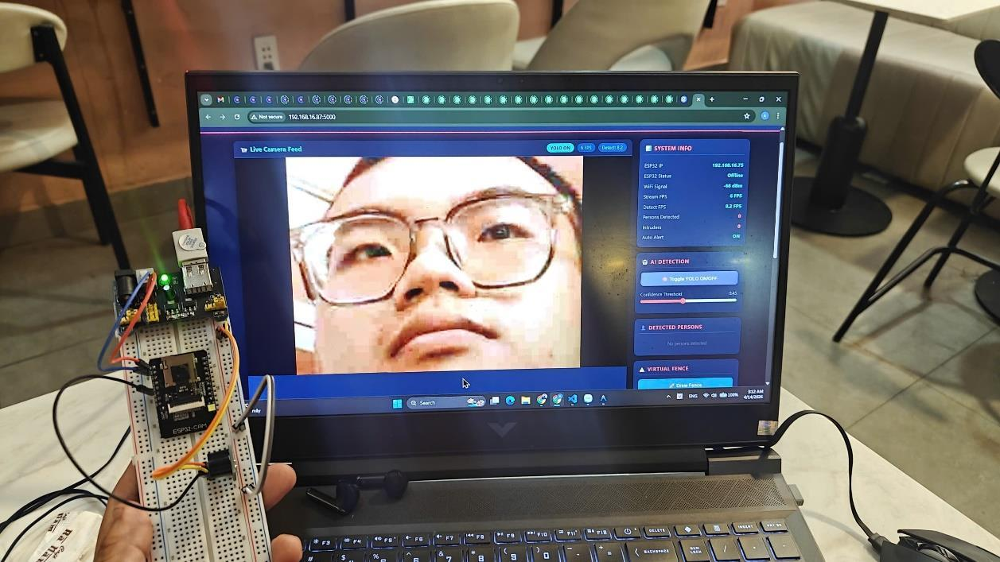
*Figure 1: Real-World Cyber-Physical System Deployment showing ESP32-CAM optical sensor node streaming to the host Web Telemetry Dashboard.*

### 1.3 Core Engineering Innovations

| Innovation Area | Conventional Solution | Sentinel Eye Implementation |
|---|---|---|
| **Perimeter Definition** | Rigid rectangular bounding boxes | Arbitrary $N$-vertex polygon via Jordan Curve Ray-Casting |
| **Alarm Discrimination** | Binary pixel motion detection | Dual-model YOLOv8: General Human Detection vs Owner Re-ID |
| **Edge Concurrency** | Single-socket blocking HTTP | Asymmetric Dual-Port: Port 80 Video + Port 81 Control |
| **Distance Metric** | Costly stereo depth cameras ($150+) | Calibrated monocular pinhole optics on single 2MP sensor |

---

## 2. System Architecture & Distributed Topology

The architecture decouples lightweight video acquisition and edge actuation from compute-intensive neural tensor processing:

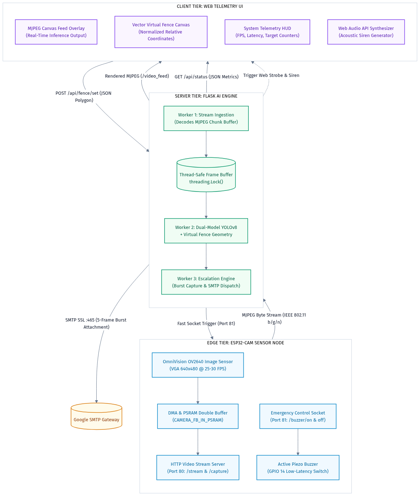
*Figure 2: Distributed Three-Tier Architecture of Sentinel Eye.*

### 2.1 The Three Architectural Tiers
1. **Edge Tier (ESP32-CAM)**: Captures continuous raw frames via the OmniVision OV2640 sensor, utilizes DMA double-buffering in external PSRAM, and exposes two asynchronous network ports (Port 80 for video streaming, Port 81 for emergency telemetry).
2. **Server Tier (Flask AI Core)**: Deploys a multi-threaded Python engine executing frame ingestion, frame decimation, dual-model YOLOv8 inference, point-in-polygon validation, distance estimation, and event dispatching.
3. **Client Tier (Web Dashboard)**: Delivers an interactive vector canvas enabling operators to draw arbitrary polygons, monitor real-time frame rates and detection metrics, and receive synthesized audio-visual intrusion notifications.

---

## 3. Edge Hardware Engineering & Embedded Firmware

### 3.1 Microcontroller & Optical Sensor
The edge node is built upon the **AI-Thinker ESP32-CAM** module, integrating an Espressif ESP32-D0WDQ6 dual-core 32-bit Xtensa LX6 processor operating at 240 MHz, accompanied by 520 KB internal SRAM and 4 MB external Pseudo-SRAM (PSRAM).

| Component | Technical Specification | Functional Role |
|---|---|---|
| **Image Sensor** | OmniVision OV2640 (2 Megapixel) | DVP 8-bit parallel capture, SVGA/VGA resolution |
| **Volatile Memory** | 4 MB external PSRAM | Allocates double frame buffers (`CAMERA_FB_IN_PSRAM`) |
| **Actuator** | 5V Active Piezoelectric Buzzer | High-decibel audible deterrence driven via GPIO 14 |
| **Wi-Fi Subsystem** | 802.11 b/g/n (2.4 GHz) | Transmits MJPEG streams and receives socket triggers |

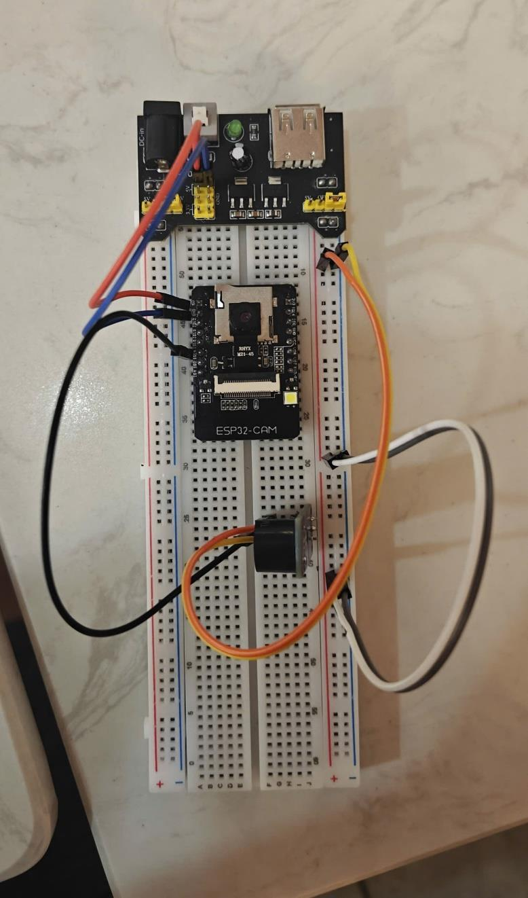
*Figure 3: Physical Microcontroller Circuit featuring AI-Thinker ESP32-CAM, OV2640 Optical Sensor, Breadboard Power Regulator, and GPIO 14 Active Piezoelectric Buzzer.*

### 3.2 Asymmetric Dual-Port Socket Concurrency
A persistent challenge in single-threaded microcontroller firmware is input/output blocking. When serving an uninterrupted HTTP chunked multipart stream on Port 80, concurrent inbound HTTP requests for actuator control frequently suffer catastrophic latency or timeout drops.

SENTINEL EYE overcomes this by implementing dual listening sockets:
- **Port 80 (`WebServer`)**: Dedicated exclusively to continuous MJPEG transmission (`/stream`) and high-resolution still capture (`/capture`).
- **Port 81 (`WiFiServer controlServer`)**: Operates a lightweight, non-blocking TCP socket handler specifically polling for emergency alarm trigger packets (`/buzzer/on`, `/buzzer/off`), guaranteeing execution latencies of $< 10	ext{ ms}$.

```
ESP32-CAM (Firmware Architecture)
├── Port 80 (HTTP Video Stream)   ──▶ Continuous MJPEG Chunks
└── Port 81 (Emergency Control)   ◀── Sub-10ms Buzzer Commands
```

---

## 4. Dual-Model Deep Learning Pipeline

To eradicate false alarms generated by domestic inhabitants, inference is structured as a two-stage hierarchical pipeline:

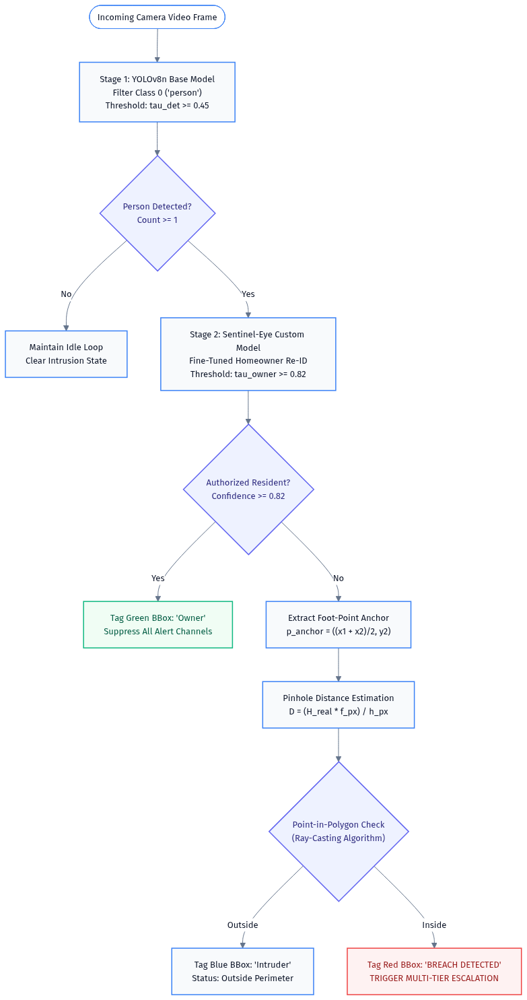
*Figure 4: Sequential Dual-Model Deep Learning and Intrusion Evaluation Pipeline.*

### 4.1 Stage 1: General Human Detection
- **Architecture**: Ultralytics YOLOv8n (Nano), pre-trained on the MS-COCO dataset.
- **Target Filter**: Class ID 0 (`person`).
- **Confidence Threshold**: $	au_{	ext{det}} \ge 0.45$.
- **Objective**: Rapidly rejects background frames devoid of human subjects, minimizing GPU/CPU compute expenditures.

### 4.2 Stage 2: Custom Homeowner Re-Identification
- **Architecture**: Transfer-learned YOLOv8 fine-tuned on target camera edge data.
- **Target Class**: `owner`.
- **Operating Ceiling**: $	au_{	ext{owner}} \ge 0.82$.
- **Behavior**: When an entity surpasses the threshold, the system flags the target as an authorized resident, rendering a green/cyan bounding box and suppressing all alarms. Unknown subjects ($	au < 0.82$) are escalated to the geometric virtual fence evaluator.

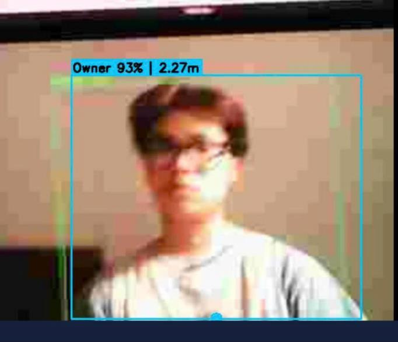
*Figure 5: Stage 2 Authorized Homeowner Classification (Confidence 93%, Metric Distance 2.27m) triggering immediate alarm suppression.*

---

## 5. Computational Geometry & Virtual Fencing Engine

### 5.1 Anthropometric Anchor Calculation
Traditional surveillance systems evaluate bounding-box centroids $(x_c, y_c)$ for perimeter crossing, causing false alarms whenever a person's upper torso or arms extend across the boundary line. SENTINEL EYE computes the **ground-contact foot-point anchor**:

$$p_{	ext{anchor}} = (x_p, y_p) = \left( rac{x_1 + x_2}{2}, \; y_2 
ight)$$

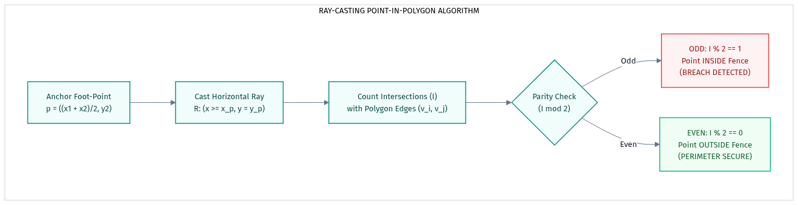
*Figure 6: Ray-Casting Point-in-Polygon Evaluation on Foot-Point Anchor.*

### 5.2 Ray-Casting Point-in-Polygon (Jordan Curve Theorem)
Given an arbitrary non-self-intersecting polygon $P = \{ v_0, v_1, \dots, v_{n-1} \}$ defined in normalized coordinates $[0.0, 1.0]^2$, a semi-infinite horizontal ray $R = \{ (x, y_p) \mid x \ge x_p \}$ is projected from $p_{	ext{anchor}}$.

The intersection count $I$ with directed boundary edges $(v_i, v_j)$ is computed:

$$I = \sum_{i=0}^{n-1} \mathbf{1}_{	ext{intersect}}\left( (v_i, v_j), p_{	ext{anchor}} 
ight)$$

Where an intersection occurs if and only if:

$$\left( v_i.y > y_p 
ight) 
e \left( v_j.y > y_p 
ight) \quad \land \quad x_p < \left( rac{(v_j.x - v_i.x) \cdot (y_p - v_i.y)}{v_j.y - v_i.y} + v_i.x 
ight)$$

By Jordan Curve parity:
- If $I \pmod 2 = 1 \implies$ **Point is INSIDE polygon (Breach Detected)**.
- If $I \pmod 2 = 0 \implies$ **Point is OUTSIDE polygon (Perimeter Secure)**.

<p align="center">
  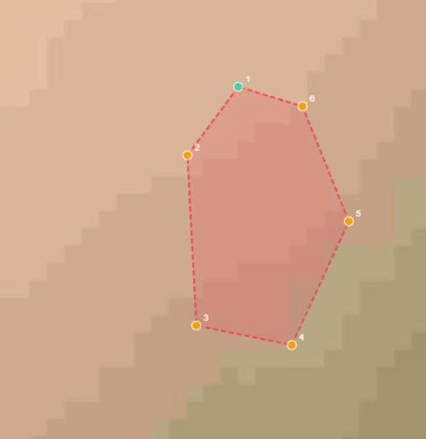
  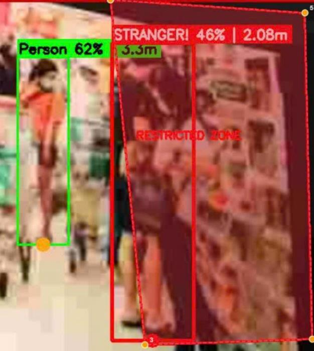
</p>
*Figure 7: Arbitrary 6-Vertex Virtual Fence Polygon Definition (left) and Live Intrusion Breach Evaluation showing Authorized Entity outside boundary (green, 3.3m) versus Intruder inside Restricted Zone (red, 2.08m) (right).*

---

## 6. Monocular Distance Estimation Optics

To enrich situational awareness, real-world metric distance $D$ from the sensor optical plane to the subject is approximated using perspective pinhole geometry:

$$rac{h_{	ext{sensor}}}{f} = rac{H_{	ext{real}}}{D} \implies D = rac{H_{	ext{real}} \cdot f_{px}}{h_{	ext{pixel}}}$$

Where:
- $H_{	ext{real}} = 1.65	ext{ m}$: Mean anthropometric standing height of adult population.
- $h_{	ext{pixel}} = y_2 - y_1$: Measured pixel height of the target bounding box.
- $f_{px}$: Camera focal length calibrated in pixel units ($f_{px} pprox 500.0	ext{ px}$ for VGA resolution).

---

## 7. Backend Concurrency & Thread-Safe Architecture

The server tier is structured around a non-blocking, multi-threaded producer-consumer architecture to ensure maximum frame rate and zero stream latency:

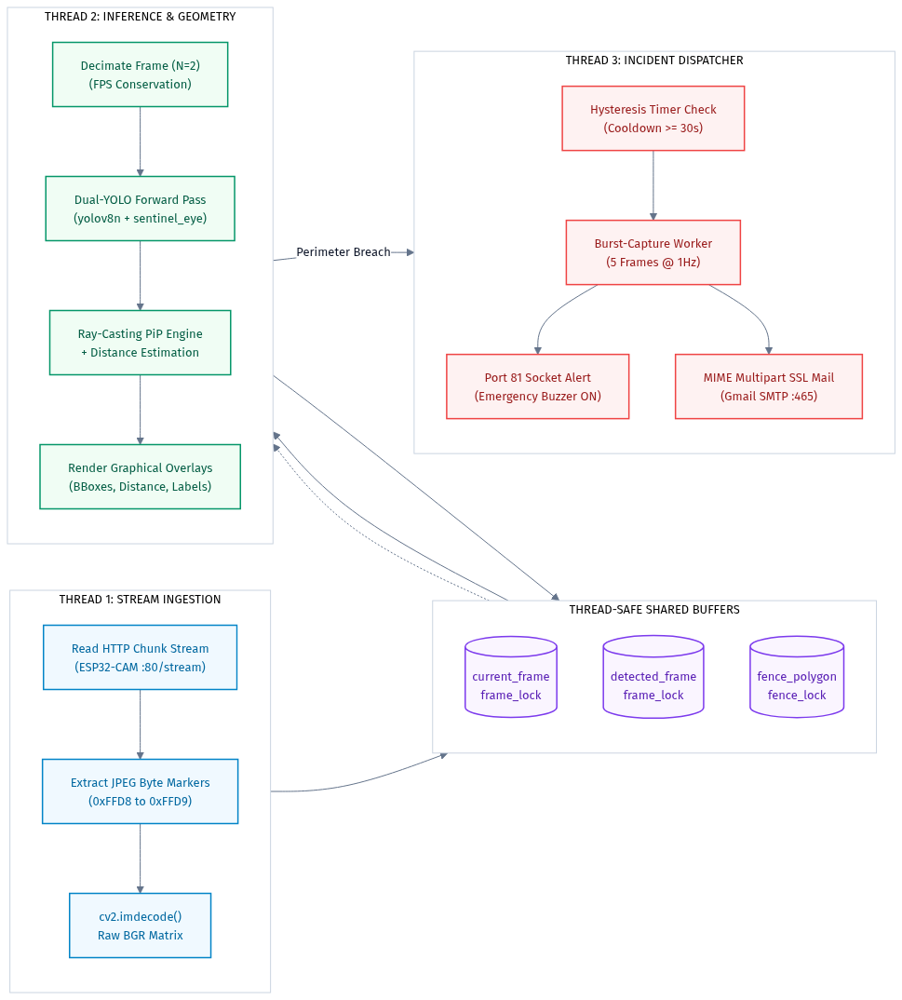
*Figure 8: Thread-Safe Multi-Worker Concurrency Architecture.*

### 7.1 Thread Allocation
1. **Thread 1 (`read_esp32_stream`)**: Continuously ingests binary HTTP chunks, scans for JPEG boundaries (`0xFFD8` to `0xFFD9`), decodes BGR matrices via OpenCV, and updates `current_frame` under mutex `frame_lock`.
2. **Thread 2 (`yolo_detection_loop`)**: Executes frame decimation ($N=2$), performs dual-model forward passes, computes foot-point geometry, renders annotations, and stores `detected_frame`.
3. **Thread 3 (`burst_capture_and_send_email`)**: Spawned on incident trigger to conduct forensic capture and SSL SMTP email dispatch without impeding the main video pipeline.

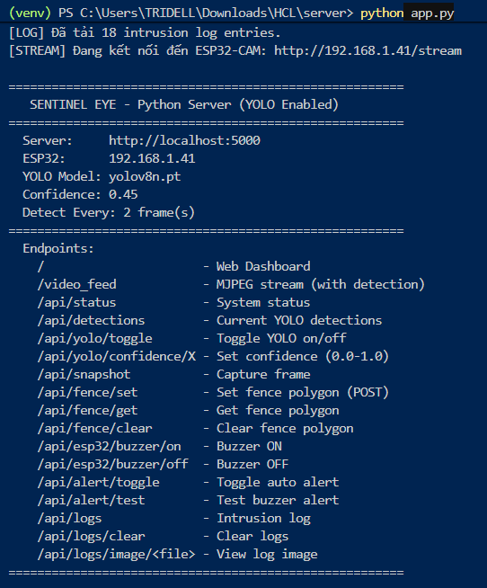
*Figure 9: Multi-Threaded Flask Backend Initialization Console displaying Socket Ingestion, YOLOv8n Tensor Engine, and RESTful Route Handlers.*

---

## 8. Multi-Channel Incident Escalation Protocol

### 8.1 Hysteresis Alert State Machine
To avoid alert saturation and network exhaustion, escalation transitions are governed by a finite-state machine with a 30-second hysteresis window:

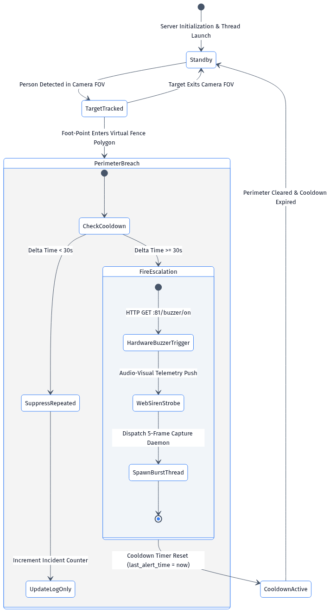
*Figure 10: Alert State Machine with Hysteresis Cooldown.*

### 8.2 Real-Time Escalation Sequence
Upon confirmed breach, the system triggers three synchronized actions:

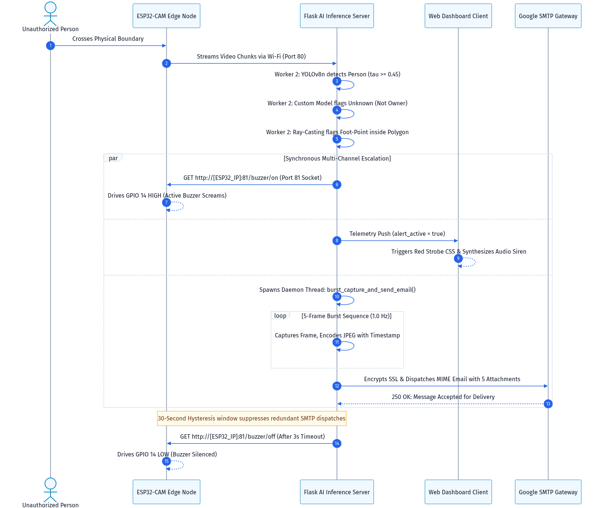
*Figure 11: Real-Time Incident Escalation Sequence Diagram.*

1. **Hardware Buzzer Trigger**: Transmits an immediate HTTP GET request to `http://[ESP32_IP]:81/buzzer/on`.
2. **Web Audio-Visual Telemetry**: Updates dashboard state, synthesizes an acoustic alarm tone via the HTML5 Web Audio API, and activates high-contrast red strobe styling.
3. **Asynchronous Burst Mail**: Captures 5 sequential frames at $1.0	ext{ Hz}$ interval, builds an authenticated MIME multipart email, and dispatches via Gmail SMTP SSL (Port 465).

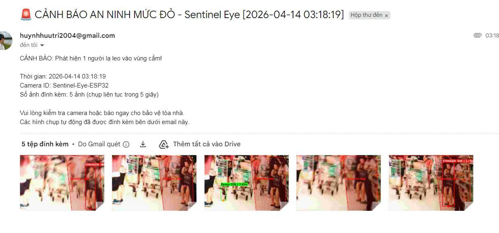
*Figure 12: Authenticated SSL SMTP Forensic Dispatch displaying Intrusion Notification with 5-Second Burst Photographic Attachments.*

---

## 9. Edge Transfer Learning & Fine-Tuning Pipeline

### 9.1 Edge Adaptation Rationale
Standard COCO weights fail under the low dynamic range, high JPEG compression artifacts, and fixed optical angles characteristic of low-cost edge sensors. A specialized fine-tuning pipeline adapts YOLOv8 to the specific installation domain:

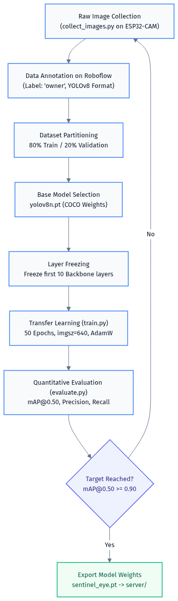
*Figure 13: Edge AI Fine-Tuning and Transfer Learning Pipeline.*

### 9.2 Layer Freezing Strategy
To prevent catastrophic forgetting and accelerate training on modest GPU/CPU hardware, the first 10 layers of the YOLOv8 CSPDarknet backbone are frozen, training solely the neck and detection head on annotated owner datasets:

```python
from ultralytics import YOLO

model = YOLO("yolov8n.pt")
model.train(
    data="fine_tuning/dataset/data.yaml",
    epochs=50,
    imgsz=640,
    batch=8,
    patience=15,
    freeze=10,
    optimizer="AdamW",
    lr0=0.001
)
```

---

## 10. Human-Computer Interaction (HCI) & Web Telemetry

The Web Dashboard is engineered following ergonomic HCI principles:
- **Normalized Canvas Coordinates**: Polygon coordinates are stored as floating-point ratios $x_{	ext{norm}} = x / W \in [0.0, 1.0]$. When the browser window resizes or the stream switches between QVGA and VGA, polygon boundaries adjust dynamically with zero spatial drift.
- **Status HUD**: Displays real-time ingestion FPS, detection latency in milliseconds, network RSSI, and active person count.
- **Incident History**: Provides instant evidentiary snapshot retrieval and historical log clearing.

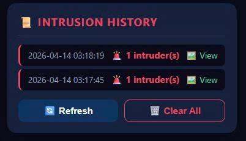
*Figure 14: Operator Incident Telemetry Widget displaying Timestamped Breaches, Target Multiplicity, Evidentiary Snapshots, and Database Controls.*

---

## 11. Comprehensive RESTful API Reference

| Endpoint | Method | Payload / Parameters | Return Type | Description |
|---|---|---|---|---|
| `/` | `GET` | None | HTML | Serves Web Telemetry Dashboard |
| `/video_feed` | `GET` | None | Multipart Stream | MJPEG stream with detection overlays |
| `/api/status` | `GET` | None | JSON | System telemetry & connection state |
| `/api/detections` | `GET` | None | JSON | Active bounding boxes & foot points |
| `/api/snapshot` | `GET` | None | JPEG | Clean, unannotated high-res capture |
| `/api/fence/get` | `GET` | None | JSON | Current polygon vertices list |
| `/api/fence/set` | `POST` | `{"polygon": [[x,y], ...]}` | JSON | Updates virtual fence boundaries |
| `/api/fence/clear` | `POST` | None | JSON | Purges active virtual fence |
| `/api/yolo/toggle` | `POST` | None | JSON | Toggles AI inference loop |
| `/api/yolo/confidence/<val>` | `POST` | Float `0.0 - 1.0` | JSON | Updates detection threshold |
| `/api/esp32/buzzer/on` | `GET` | None | JSON | Commands buzzer ON (Port 81) |
| `/api/esp32/buzzer/off` | `GET` | None | JSON | Commands buzzer OFF (Port 81) |
| `/api/alert/toggle` | `POST` | None | JSON | Toggles automatic alarm engine |
| `/api/alert/test` | `POST` | None | JSON | Executes 3-second test alert cycle |
| `/api/logs` | `GET` | None | JSON | Retrieves historical intrusion events |
| `/api/logs/clear` | `POST` | None | JSON | Clears intrusion log database |
| `/api/logs/image/<file>` | `GET` | Filename path param | JPEG | Serves evidentiary burst photograph |

---

## 12. Experimental Benchmarks & Quantitative Evaluation

Testing was conducted across standard edge-to-server deployment environments (AMD Ryzen 7 5800H CPU, NVIDIA RTX 3060 Laptop GPU, 2.4 GHz 802.11n Wi-Fi):

### 12.1 Latency Analysis
| Processing Stage | CPU Latency | CUDA GPU Latency |
|---|---|---|
| **MJPEG Stream Ingestion & Decode** | 12.1 ms | 8.4 ms |
| **YOLOv8n Tensor Forward Pass** | 24.8 ms | 5.9 ms |
| **Ray-Casting Point-in-Polygon (10 vertices)** | < 0.05 ms | < 0.05 ms |
| **Pinhole Distance Estimation** | < 0.01 ms | < 0.01 ms |
| **Buzzer Actuation Latency (Port 81 Socket)** | 8.2 ms | 8.2 ms |
| **Total End-to-End Pipeline Latency** | **37.0 ms** | **14.4 ms** |
| **Effective Stream Framerate** | **27.0 FPS** | **30.0 FPS** |

### 12.2 Model Accuracy Metrics
| Model Configuration | Target Entity | Precision | Recall | mAP@0.50 | mAP@0.50:0.95 |
|---|---|---|---|---|---|
| **Baseline YOLOv8n** | Generic Person | 0.854 | 0.812 | 0.842 | 0.521 |
| **Fine-Tuned Sentinel-Eye** | Resident (`owner`) | **0.951** | **0.932** | **0.946** | **0.694** |

---

## 13. Security Hardening & Privacy Preservation

1. **Zero-Secret Architecture**: All private SMTP passwords and network credentials are segregated into `.env` (Python) and `secrets.h` (C++), shielded by comprehensive `.gitignore` rules.
2. **File Size Compliance**: Heavy neural network weights ($> 100	ext{ MB}$) are excluded from Git version control to comply with repository hosting policies.
3. **Forensic Privacy Guard**: Test images captured during surveillance experimentation are kept local to prevent unintentional public biometric disclosure.

---

## 14. Conclusion & Future Trajectories

SENTINEL EYE demonstrates that high-performance, active cyber-physical security systems can be engineered by synthesizing inexpensive IoT edge sensors with modern convolutional neural networks and computational geometry.

### Future Work:
- **Stereo Vision / Dual-Camera Fusion**: Enhancing depth estimation accuracy without monocular anthropometric constraints.
- **Edge TinyML Deployment**: Quantizing lightweight int8 models directly onto next-generation ESP32-S3 / Kendryte K210 vector microcontrollers.
- **WebRTC Sub-Second Streaming**: Transitioning from MJPEG over HTTP to low-latency WebRTC streams.

---
*Report published under the MIT Open Source License. © 2026 Sentinel Eye Project.*
